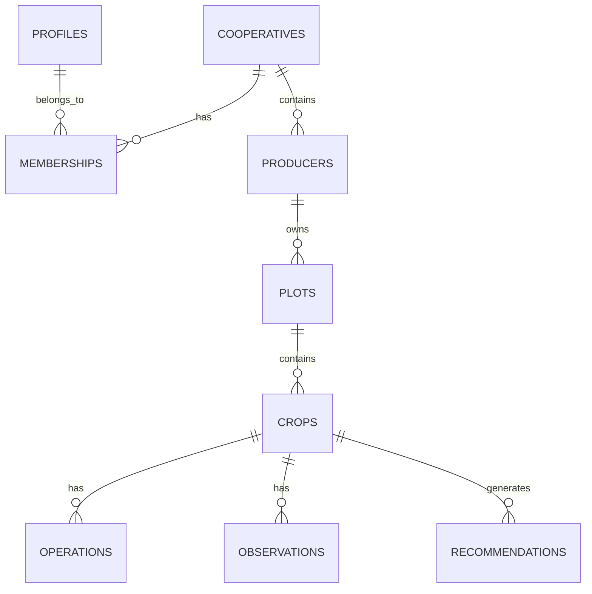

# 🗄️ Base de Données

Architecture et schéma de la base de données AgriConnect.

## 🎯 Vue d'ensemble

AgriConnect utilise PostgreSQL 15 avec l'extension PostGIS pour la gestion des données géospatiales. La base de données est hébergée sur Supabase avec Row Level Security (RLS) activé.

## 🏗️ Architecture

### Structure générale



## 📊 Tables Principales

### 1. Profiles (Utilisateurs)

```sql
CREATE TABLE profiles (
  id uuid PRIMARY KEY REFERENCES auth.users ON DELETE CASCADE,
  phone text UNIQUE NOT NULL,
  role user_role NOT NULL DEFAULT 'producer',
  full_name text,
  region text,
  department text,
  commune text,
  created_at timestamptz DEFAULT now(),
  updated_at timestamptz DEFAULT now()
);

-- RLS Policy
CREATE POLICY "Users can view own profile" ON profiles
  FOR SELECT USING (auth.uid() = id);
```

**Rôles disponibles :**
- `admin` : Administrateur système
- `supervisor` : Superviseur régional
- `agent` : Agent de terrain
- `producer` : Producteur

### 2. Cooperatives

```sql
CREATE TABLE cooperatives (
  id uuid PRIMARY KEY DEFAULT gen_random_uuid(),
  name text NOT NULL,
  region text,
  department text,
  commune text,
  contact_phone text,
  contact_email text,
  created_by uuid REFERENCES profiles(id),
  created_at timestamptz DEFAULT now(),
  updated_at timestamptz DEFAULT now()
);

-- Index pour les recherches géographiques
CREATE INDEX idx_cooperatives_region ON cooperatives(region);
CREATE INDEX idx_cooperatives_department ON cooperatives(department);
```

### 3. Memberships (Appartenance aux coopératives)

```sql
CREATE TABLE memberships (
  id uuid PRIMARY KEY DEFAULT gen_random_uuid(),
  user_id uuid REFERENCES profiles(id) ON DELETE CASCADE,
  cooperative_id uuid REFERENCES cooperatives(id) ON DELETE CASCADE,
  role user_role NOT NULL,
  joined_at timestamptz DEFAULT now(),
  UNIQUE(user_id, cooperative_id)
);

-- RLS Policy
CREATE POLICY "Users can view memberships in their cooperatives" ON memberships
  FOR SELECT USING (
    auth.uid() = user_id OR
    auth.uid() IN (
      SELECT user_id FROM memberships m2 
      WHERE m2.cooperative_id = cooperative_id 
      AND m2.role IN ('admin', 'supervisor')
    )
  );
```

### 4. Producers (Producteurs)

```sql
CREATE TABLE producers (
  id uuid PRIMARY KEY DEFAULT gen_random_uuid(),
  name text NOT NULL,
  phone text,
  email text,
  cooperative_id uuid REFERENCES cooperatives(id) ON DELETE CASCADE,
  region text,
  department text,
  commune text,
  village text,
  created_by uuid REFERENCES profiles(id),
  created_at timestamptz DEFAULT now(),
  updated_at timestamptz DEFAULT now()
);

-- Index pour les recherches
CREATE INDEX idx_producers_cooperative ON producers(cooperative_id);
CREATE INDEX idx_producers_region ON producers(region);
```

### 5. Plots (Parcelles)

```sql
CREATE TABLE plots (
  id uuid PRIMARY KEY DEFAULT gen_random_uuid(),
  producer_id uuid REFERENCES producers(id) ON DELETE CASCADE,
  name text,
  area_ha numeric CHECK (area_ha > 0),
  soil_type text,
  water_source text,
  irrigation_type text,
  status plot_status DEFAULT 'active',
  geom geometry(Polygon, 4326),
  created_at timestamptz DEFAULT now(),
  updated_at timestamptz DEFAULT now()
);

-- Index spatial PostGIS
CREATE INDEX idx_plots_geom ON plots USING GIST (geom);

-- Index pour les recherches
CREATE INDEX idx_plots_producer ON plots(producer_id);
CREATE INDEX idx_plots_status ON plots(status);
```

**Types de sol :**
- `sableux` : Sol sableux
- `argileux` : Sol argileux
- `limoneux` : Sol limoneux
- `mixte` : Sol mixte

**Statuts de parcelle :**
- `active` : Parcelle active
- `inactive` : Parcelle inactive
- `abandoned` : Parcelle abandonnée

### 6. Crops (Cultures)

```sql
CREATE TABLE crops (
  id uuid PRIMARY KEY DEFAULT gen_random_uuid(),
  plot_id uuid REFERENCES plots(id) ON DELETE CASCADE,
  season_id uuid REFERENCES seasons(id),
  crop_type text NOT NULL,
  variety text,
  sowing_date date,
  expected_harvest date,
  actual_harvest date,
  estimated_yield_kg_ha numeric,
  actual_yield_kg_ha numeric,
  emergence_date date,
  status crop_status DEFAULT 'planted',
  created_at timestamptz DEFAULT now(),
  updated_at timestamptz DEFAULT now()
);

-- Index pour les recherches
CREATE INDEX idx_crops_plot ON crops(plot_id);
CREATE INDEX idx_crops_season ON crops(season_id);
CREATE INDEX idx_crops_type ON crops(crop_type);
CREATE INDEX idx_crops_status ON crops(status);
```

**Types de cultures :**
- `mil` : Mil
- `mais` : Maïs
- `riz` : Riz
- `arachide` : Arachide
- `niébé` : Niébé
- `sorgho` : Sorgho

**Statuts de culture :**
- `planted` : Plantée
- `emerged` : Levée
- `growing` : En croissance
- `flowering` : En floraison
- `mature` : Mature
- `harvested` : Récoltée

### 7. Operations (Opérations agricoles)

```sql
CREATE TABLE operations (
  id uuid PRIMARY KEY DEFAULT gen_random_uuid(),
  crop_id uuid REFERENCES crops(id) ON DELETE CASCADE,
  operation_type operation_type NOT NULL,
  date date NOT NULL,
  notes text,
  quantity numeric,
  unit text,
  cost numeric,
  performed_by uuid REFERENCES profiles(id),
  created_at timestamptz DEFAULT now(),
  updated_at timestamptz DEFAULT now()
);

-- Index pour les recherches
CREATE INDEX idx_operations_crop ON operations(crop_id);
CREATE INDEX idx_operations_type ON operations(operation_type);
CREATE INDEX idx_operations_date ON operations(date);
```

**Types d'opérations :**
- `semis` : Semis
- `fertilisation` : Fertilisation
- `irrigation` : Irrigation
- `desherbage` : Désherbage
- `traitement_phyto` : Traitement phytosanitaire
- `recolte` : Récolte

### 8. Observations (Observations terrain)

```sql
CREATE TABLE observations (
  id uuid PRIMARY KEY DEFAULT gen_random_uuid(),
  crop_id uuid REFERENCES crops(id) ON DELETE CASCADE,
  observation_type observation_type NOT NULL,
  severity integer CHECK (severity >= 1 AND severity <= 5),
  description text,
  photos text[], -- URLs des photos
  location geometry(Point, 4326),
  observed_by uuid REFERENCES profiles(id),
  created_at timestamptz DEFAULT now(),
  updated_at timestamptz DEFAULT now()
);

-- Index spatial
CREATE INDEX idx_observations_location ON observations USING GIST (location);
CREATE INDEX idx_observations_crop ON observations(crop_id);
CREATE INDEX idx_observations_type ON observations(observation_type);
```

**Types d'observations :**
- `emergence` : Levée
- `disease` : Maladie
- `pest` : Ravageur
- `drought` : Sécheresse
- `flood` : Inondation
- `nutrient_deficiency` : Carence nutritionnelle

### 9. Recommendations (Recommandations)

```sql
CREATE TABLE recommendations (
  id uuid PRIMARY KEY DEFAULT gen_random_uuid(),
  crop_id uuid REFERENCES crops(id) ON DELETE CASCADE,
  rule_id uuid REFERENCES agri_rules(id),
  message text NOT NULL,
  priority priority_level DEFAULT 'medium',
  status recommendation_status DEFAULT 'pending',
  created_at timestamptz DEFAULT now(),
  updated_at timestamptz DEFAULT now()
);

-- Index pour les recherches
CREATE INDEX idx_recommendations_crop ON recommendations(crop_id);
CREATE INDEX idx_recommendations_status ON recommendations(status);
CREATE INDEX idx_recommendations_priority ON recommendations(priority);
```

**Niveaux de priorité :**
- `low` : Faible
- `medium` : Moyenne
- `high` : Élevée
- `critical` : Critique

**Statuts de recommandation :**
- `pending` : En attente
- `sent` : Envoyée
- `acknowledged` : Reconnue
- `implemented` : Implémentée

### 10. Seasons (Saisons agricoles)

```sql
CREATE TABLE seasons (
  id uuid PRIMARY KEY DEFAULT gen_random_uuid(),
  name text NOT NULL,
  year integer NOT NULL,
  start_date date NOT NULL,
  end_date date NOT NULL,
  is_active boolean DEFAULT false,
  created_at timestamptz DEFAULT now(),
  updated_at timestamptz DEFAULT now()
);

-- Index pour les recherches
CREATE INDEX idx_seasons_year ON seasons(year);
CREATE INDEX idx_seasons_active ON seasons(is_active);
```

## 🔒 Sécurité (RLS)

### Politiques de sécurité

```sql
-- Exemple : Les agents ne peuvent voir que les producteurs de leur coopérative
CREATE POLICY "Agents can view producers in their cooperative" ON producers
  FOR SELECT USING (
    cooperative_id IN (
      SELECT cooperative_id FROM memberships 
      WHERE user_id = auth.uid() 
      AND role IN ('agent', 'supervisor', 'admin')
    )
  );

-- Exemple : Les producteurs ne peuvent voir que leurs propres parcelles
CREATE POLICY "Producers can view own plots" ON plots
  FOR SELECT USING (
    producer_id IN (
      SELECT id FROM producers 
      WHERE cooperative_id IN (
        SELECT cooperative_id FROM memberships 
        WHERE user_id = auth.uid()
      )
    )
  );
```

## 📊 Requêtes Spatiales

### Exemples d'utilisation PostGIS

```sql
-- Trouver toutes les parcelles dans un rayon de 5km
SELECT p.*, ST_Distance(p.geom, ST_Point(-16.2518, 14.6928)) as distance_m
FROM plots p
WHERE ST_DWithin(p.geom, ST_Point(-16.2518, 14.6928), 5000)
ORDER BY distance_m;

-- Calculer la superficie totale des parcelles d'un producteur
SELECT 
  producer_id,
  SUM(ST_Area(geom::geography)) / 10000 as total_area_ha
FROM plots
WHERE producer_id = 'uuid-here'
GROUP BY producer_id;

-- Trouver les parcelles qui intersectent une zone donnée
SELECT p.*
FROM plots p
WHERE ST_Intersects(p.geom, ST_MakeEnvelope(-16.3, 14.6, -16.2, 14.7, 4326));
```

## 🔄 Triggers et Fonctions

### Mise à jour automatique des timestamps

```sql
-- Fonction pour mettre à jour updated_at
CREATE OR REPLACE FUNCTION update_updated_at_column()
RETURNS TRIGGER AS $$
BEGIN
    NEW.updated_at = now();
    RETURN NEW;
END;
$$ language 'plpgsql';

-- Appliquer à toutes les tables
CREATE TRIGGER update_profiles_updated_at BEFORE UPDATE ON profiles
    FOR EACH ROW EXECUTE FUNCTION update_updated_at_column();

CREATE TRIGGER update_cooperatives_updated_at BEFORE UPDATE ON cooperatives
    FOR EACH ROW EXECUTE FUNCTION update_updated_at_column();

-- ... (répéter pour toutes les tables)
```

### Fonctions métier

```sql
-- Calculer le rendement moyen d'une culture
CREATE OR REPLACE FUNCTION get_crop_yield_average(crop_type_param text)
RETURNS numeric AS $$
BEGIN
    RETURN (
        SELECT AVG(actual_yield_kg_ha)
        FROM crops
        WHERE crop_type = crop_type_param
        AND actual_yield_kg_ha IS NOT NULL
    );
END;
$$ LANGUAGE plpgsql;

-- Détecter les cultures en retard de levée
CREATE OR REPLACE FUNCTION get_late_emergence_crops(days_threshold integer)
RETURNS TABLE(crop_id uuid, days_late integer) AS $$
BEGIN
    RETURN QUERY
    SELECT c.id, 
           EXTRACT(day FROM (now() - c.sowing_date))::integer - days_threshold as days_late
    FROM crops c
    WHERE c.emergence_date IS NULL
    AND c.sowing_date < now() - INTERVAL '1 day' * days_threshold;
END;
$$ LANGUAGE plpgsql;
```

## 📈 Performance et Index

### Index stratégiques

```sql
-- Index composites pour les requêtes fréquentes
CREATE INDEX idx_crops_plot_season ON crops(plot_id, season_id);
CREATE INDEX idx_operations_crop_date ON operations(crop_id, date);
CREATE INDEX idx_observations_crop_type ON observations(crop_id, observation_type);

-- Index partiels pour les données actives
CREATE INDEX idx_active_crops ON crops(plot_id) WHERE status != 'harvested';
CREATE INDEX idx_pending_recommendations ON recommendations(crop_id) WHERE status = 'pending';
```

### Statistiques et monitoring

```sql
-- Vérifier les statistiques des tables
SELECT 
    schemaname,
    tablename,
    n_tup_ins as inserts,
    n_tup_upd as updates,
    n_tup_del as deletes,
    n_live_tup as live_tuples
FROM pg_stat_user_tables
ORDER BY n_live_tup DESC;

-- Vérifier l'utilisation des index
SELECT 
    indexname,
    idx_tup_read,
    idx_tup_fetch
FROM pg_stat_user_indexes
WHERE schemaname = 'public'
ORDER BY idx_tup_read DESC;
```

## 🧪 Tests de la base de données

### Tests de contraintes

```sql
-- Test des contraintes de validation
INSERT INTO plots (producer_id, area_ha) VALUES ('uuid', -1); -- Doit échouer
INSERT INTO observations (crop_id, observation_type, severity) VALUES ('uuid', 'disease', 6); -- Doit échouer

-- Test des contraintes de clés étrangères
INSERT INTO crops (plot_id) VALUES ('non-existent-uuid'); -- Doit échouer
```

### Tests de performance

```sql
-- Test des requêtes spatiales
EXPLAIN ANALYZE
SELECT * FROM plots 
WHERE ST_DWithin(geom, ST_Point(-16.2518, 14.6928), 1000);

-- Test des requêtes complexes
EXPLAIN ANALYZE
SELECT p.name, c.crop_type, AVG(o.actual_yield_kg_ha)
FROM plots p
JOIN crops c ON p.id = c.plot_id
JOIN operations o ON c.id = o.crop_id
WHERE p.producer_id = 'uuid'
GROUP BY p.name, c.crop_type;
```

## 📚 Ressources

- [Documentation PostgreSQL](https://www.postgresql.org/docs/)
- [Documentation PostGIS](https://postgis.net/documentation/)
- [Documentation Supabase](https://supabase.com/docs/guides/database)
- [RLS Guide](https://supabase.com/docs/guides/auth/row-level-security)

## 🆘 Support

En cas de problème :
- Consultez les [problèmes courants](../troubleshooting/common-issues.md)
- Ouvrez une [issue GitHub](https://github.com/agriconnect/agriconnect/issues)
- Contactez : pirlothiouk@gmail.com
