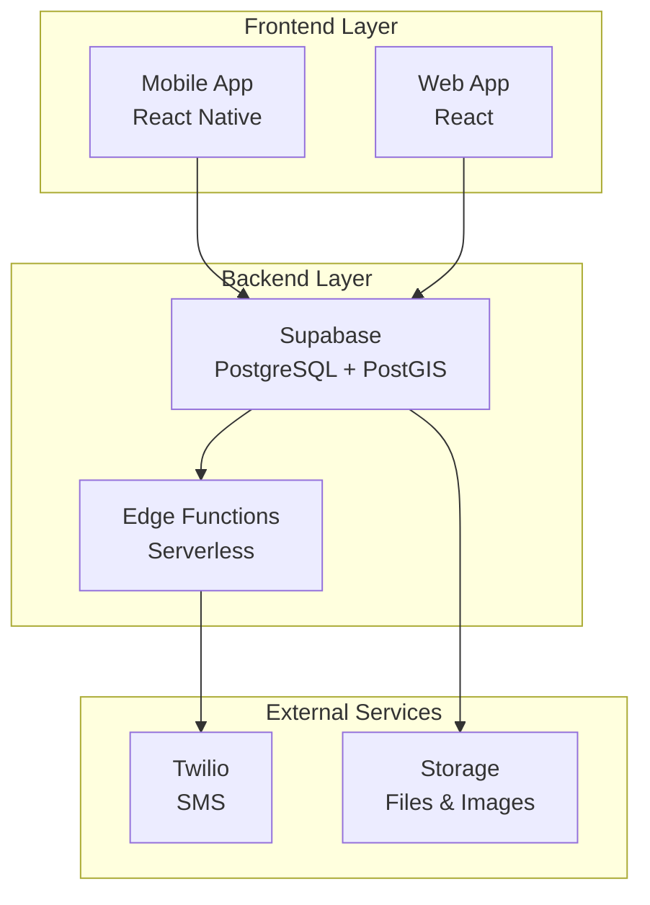
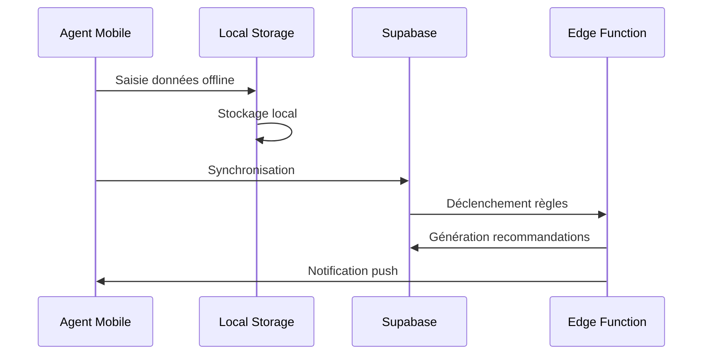
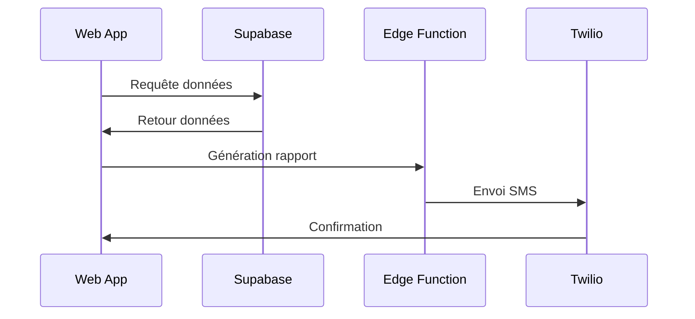

# 🏗️ Architecture Générale

Vue d'ensemble de l'architecture d'AgriConnect, une plateforme numérique agricole moderne et scalable.

## 🎯 Vue d'ensemble

AgriConnect suit une architecture **multi-tier** avec séparation claire des responsabilités :



## 🏛️ Architecture en Couches

### 1. **Couche Présentation (Frontend)**

#### Application Mobile (React Native)
- **Framework** : React Native avec Expo SDK 53
- **Navigation** : Expo Router (file-based routing)
- **State Management** : Context API + Zustand
- **UI Components** : NativeBase + composants personnalisés
- **Offline Support** : SQLite local + synchronisation

#### Application Web (React)
- **Framework** : React 19 + Vite + TypeScript
- **UI Library** : Tailwind CSS + composants personnalisés
- **State Management** : Zustand + React Query
- **Routing** : React Router v6

### 2. **Couche Logique Métier (Backend)**

#### Supabase Backend
- **Base de données** : PostgreSQL 15+ avec PostGIS
- **Authentification** : Supabase Auth (OTP par téléphone)
- **API** : REST auto-générée + RPC personnalisées
- **Sécurité** : Row Level Security (RLS) par rôle
- **Storage** : Supabase Storage pour fichiers

#### Edge Functions
- **Runtime** : Deno (TypeScript natif)
- **Fonctions** :
  - Traitement des règles agricoles
  - Envoi de notifications SMS
  - Génération de rapports
  - Synchronisation de données

### 3. **Couche Données**

#### Base de données PostgreSQL
```sql
-- Tables principales
cooperatives     -- Gestion des coopératives
producers        -- Informations producteurs
plots           -- Parcelles avec géolocalisation
crops           -- Cultures et variétés
operations      -- Opérations agricoles
observations    -- Observations terrain
recommendations -- Conseils automatisés
notifications   -- Historique communications
```

#### Géolocalisation (PostGIS)
- **Types géométriques** : Point, Polygon, LineString
- **SRID** : 4326 (WGS84)
- **Indexation spatiale** : GIST indexes
- **Requêtes spatiales** : Distance, intersection, buffer

## 🔄 Flux de Données

### Collecte Terrain (Mobile)


### Supervision (Web)


## 🔒 Modèle de Sécurité

### Authentification
- **Méthode** : OTP par numéro de téléphone
- **Tokens** : JWT avec expiration 7 jours
- **Renouvellement** : Automatique en arrière-plan

### Autorisation (RBAC)
```typescript
enum UserRole {
  ADMIN = 'admin',           // Accès complet
  SUPERVISOR = 'supervisor', // Supervision régionale
  AGENT = 'agent',          // Collecte terrain
  PRODUCER = 'producer'     // Consultation données
}
```

### Row Level Security (RLS)
- **Isolation par coopérative** : Chaque coopérative voit uniquement ses données
- **Permissions granulaires** : Lecture/écriture selon le rôle
- **Audit trail** : Traçabilité complète des modifications

## 📊 Performance et Scalabilité

### Optimisations Mobile
- **Lazy loading** : Chargement à la demande
- **Cache intelligent** : Mise en cache des données fréquentes
- **Compression** : Images et données optimisées
- **Offline-first** : Fonctionnement sans connexion

### Optimisations Backend
- **Indexation** : Index stratégiques sur les requêtes fréquentes
- **Pagination** : Limitation des résultats
- **Connection pooling** : Gestion optimisée des connexions
- **CDN** : Distribution des assets statiques

## 🔧 Intégrations

### Services Externes
- **Twilio** : Notifications SMS
- **Expo Push** : Notifications push mobiles
- **PostGIS** : Géolocalisation et cartographie
- **Supabase Storage** : Gestion des fichiers

### APIs Futures
- **Odoo** : Intégration ERP
- **Power BI** : Tableaux de bord avancés
- **SIASP** : Système d'information agricole public

## 📈 Monitoring et Observabilité

### Métriques Clés
- **Performance** : Temps de réponse < 800ms
- **Disponibilité** : 99.9% uptime
- **Synchronisation** : < 5s pour sync offline
- **Notifications** : < 2s pour envoi SMS

### Logging
- **Structured logging** : Format JSON
- **Correlation IDs** : Traçabilité des requêtes
- **Error tracking** : Sentry intégration
- **Audit logs** : Traçabilité des actions sensibles

## 🚀 Déploiement

### Environnements
- **Development** : Local avec Supabase local
- **Staging** : Supabase staging + Vercel preview
- **Production** : Supabase production + Vercel production

### CI/CD
- **GitHub Actions** : Tests automatiques
- **Déploiement automatique** : Sur push vers main
- **Rollback** : Possibilité de retour en arrière
- **Health checks** : Monitoring de la santé

## 📚 Ressources

- [Stack technique](tech-stack.md)
- [Base de données](database.md)
- [Sécurité](architecture/SECURITY.md)
- [Guide de déploiement](../deployment/guide.md)
