# 🧪 Tests

Stratégie de tests complète pour AgriConnect.

## 🎯 Vue d'ensemble

AgriConnect utilise une approche de tests en pyramide avec des tests unitaires, d'intégration et end-to-end.

## 📊 Stratégie de Tests

### Pyramide de Tests

```mermaid
graph TD
    A[Tests E2E] --> B[Tests d'Intégration]
    B --> C[Tests Unitaires]
    
    A1[Parcours utilisateur complets] --> A
    B1[API + Base de données] --> B
    C1[Composants + Services] --> C
```



**Répartition recommandée :**
- **70%** Tests unitaires
- **20%** Tests d'intégration
- **10%** Tests E2E

## 🔧 Configuration

### Jest + React Testing Library

```json
{
  "jest": "^29.7.0",
  "@testing-library/react": "^14.0.0",
  "@testing-library/react-native": "^12.0.0",
  "@testing-library/jest-dom": "^6.0.0"
}
```

### Configuration Jest

```javascript
// jest.config.js
module.exports = {
  preset: 'react-native',
  setupFilesAfterEnv: ['<rootDir>/src/setupTests.ts'],
  testMatch: ['**/__tests__/**/*.(ts|tsx|js)'],
  collectCoverageFrom: [
    'src/**/*.{ts,tsx}',
    '!src/**/*.d.ts',
    '!src/**/*.stories.{ts,tsx}',
  ],
  coverageThreshold: {
    global: {
      branches: 80,
      functions: 80,
      lines: 80,
      statements: 80,
    },
  },
  moduleNameMapping: {
    '^@/(.*)$': '<rootDir>/src/$1',
  },
};
```

## 🧪 Tests Unitaires

### Tests de Composants

```typescript
// __tests__/components/ProducerCard.test.tsx
import { render, screen, fireEvent } from '@testing-library/react-native';
import { ProducerCard } from '@/components/ProducerCard';

const mockProducer = {
  id: '1',
  name: 'Mamadou Diallo',
  phone: '+221701234567',
  cooperative: 'Coopérative Test'
};

describe('ProducerCard', () => {
  it('should display producer information', () => {
    render(<ProducerCard producer={mockProducer} />);
    
    expect(screen.getByText('Mamadou Diallo')).toBeOnTheScreen();
    expect(screen.getByText('+221701234567')).toBeOnTheScreen();
  });

  it('should call onPress when tapped', () => {
    const mockOnPress = jest.fn();
    render(<ProducerCard producer={mockProducer} onPress={mockOnPress} />);
    
    fireEvent.press(screen.getByText('Mamadou Diallo'));
    expect(mockOnPress).toHaveBeenCalledWith(mockProducer);
  });
});
```

### Tests de Hooks

```typescript
// __tests__/hooks/useProducers.test.ts
import { renderHook, waitFor } from '@testing-library/react-native';
import { useProducers } from '@/hooks/useProducers';
import { supabase } from '@/lib/supabase';

// Mock Supabase
jest.mock('@/lib/supabase', () => ({
  supabase: {
    from: jest.fn(() => ({
      select: jest.fn(() => ({
        data: [
          { id: '1', name: 'Mamadou Diallo' },
          { id: '2', name: 'Fatou Sarr' }
        ],
        error: null
      }))
    }))
  }
}));

describe('useProducers', () => {
  it('should fetch producers successfully', async () => {
    const { result } = renderHook(() => useProducers());
    
    await waitFor(() => {
      expect(result.current.loading).toBe(false);
    });
    
    expect(result.current.producers).toHaveLength(2);
    expect(result.current.producers[0].name).toBe('Mamadou Diallo');
  });
});
```

### Tests de Services

```typescript
// __tests__/services/producerService.test.ts
import { createProducer, updateProducer } from '@/services/producerService';
import { supabase } from '@/lib/supabase';

jest.mock('@/lib/supabase');

describe('producerService', () => {
  beforeEach(() => {
    jest.clearAllMocks();
  });

  it('should create a producer', async () => {
    const mockProducer = {
      name: 'Mamadou Diallo',
      phone: '+221701234567',
      cooperativeId: 'coop-1'
    };

    const mockResponse = {
      data: { id: '1', ...mockProducer },
      error: null
    };

    (supabase.from as jest.Mock).mockReturnValue({
      insert: jest.fn().mockReturnValue({
        select: jest.fn().mockResolvedValue(mockResponse)
      })
    });

    const result = await createProducer(mockProducer);
    
    expect(result).toEqual(mockResponse.data);
    expect(supabase.from).toHaveBeenCalledWith('producers');
  });
});
```

## 🔗 Tests d'Intégration

### Tests API

```typescript
// __tests__/integration/api.test.ts
import { createClient } from '@supabase/supabase-js';

const supabase = createClient(
  process.env.SUPABASE_URL!,
  process.env.SUPABASE_ANON_KEY!
);

describe('API Integration', () => {
  it('should create and retrieve a producer', async () => {
    // Créer un producteur
    const { data: producer, error: createError } = await supabase
      .from('producers')
      .insert({
        name: 'Test Producer',
        phone: '+221701234567',
        cooperative_id: 'test-coop-id'
      })
      .select()
      .single();

    expect(createError).toBeNull();
    expect(producer).toBeDefined();

    // Récupérer le producteur
    const { data: retrievedProducer, error: getError } = await supabase
      .from('producers')
      .select('*')
      .eq('id', producer.id)
      .single();

    expect(getError).toBeNull();
    expect(retrievedProducer.name).toBe('Test Producer');

    // Nettoyer
    await supabase.from('producers').delete().eq('id', producer.id);
  });
});
```

### Tests de Base de Données

```typescript
// __tests__/integration/database.test.ts
import { supabase } from '@/lib/supabase';

describe('Database Integration', () => {
  it('should enforce RLS policies', async () => {
    // Test avec un utilisateur non authentifié
    const { data, error } = await supabase
      .from('producers')
      .select('*');

    expect(error).toBeDefined();
    expect(error?.message).toContain('RLS');
  });

  it('should handle spatial queries', async () => {
    const { data, error } = await supabase
      .from('plots')
      .select('*')
      .not('geom', 'is', null);

    expect(error).toBeNull();
    expect(data).toBeDefined();
  });
});
```

## 🎭 Tests E2E

### Configuration Playwright

```typescript
// playwright.config.ts
import { defineConfig } from '@playwright/test';

export default defineConfig({
  testDir: './tests/e2e',
  fullyParallel: true,
  forbidOnly: !!process.env.CI,
  retries: process.env.CI ? 2: 0,
  workers: process.env.CI ? 1: undefined,
  reporter: 'html',
  use: {
    baseURL: 'http://localhost:5173',
    trace: 'on-first-retry',
  },
  projects: [
    {
      name: 'chromium',
      use: { ...devices['Desktop Chrome'] },
    },
    {
      name: 'webkit',
      use: { ...devices['Desktop Safari'] },
    },
  ],
  webServer: {
    command: 'npm run dev:web',
    url: 'http://localhost:5173',
    reuseExistingServer: !process.env.CI,
  },
});
```

### Tests E2E Web

```typescript
// tests/e2e/auth.spec.ts
import { test, expect } from '@playwright/test';

test.describe('Authentication', () => {
  test('should login successfully', async ({ page }) => {
    await page.goto('/login');
    
    await page.fill('[data-testid="phone-input"]', '+221701234567');
    await page.click('[data-testid="send-otp-button"]');
    
    await page.fill('[data-testid="otp-input"]', '123456');
    await page.click('[data-testid="verify-otp-button"]');
    
    await expect(page).toHaveURL('/dashboard');
  });
});
```

### Tests E2E Mobile (Detox)

```typescript
// e2e/auth.e2e.ts
import { device, expect, element, by } from 'detox';

describe('Authentication', () => {
  beforeAll(async () => {
    await device.launchApp();
  });

  it('should login successfully', async () => {
    await element(by.id('phone-input')).typeText('+221701234567');
    await element(by.id('send-otp-button')).tap();
    
    await element(by.id('otp-input')).typeText('123456');
    await element(by.id('verify-otp-button')).tap();
    
    await expect(element(by.id('dashboard'))).toBeVisible();
  });
});
```

## 📊 Tests de Performance

### Tests de Charge

```typescript
// tests/performance/load.test.ts
import { check, sleep } from 'k6';
import http from 'k6/http';

export let options = {
  stages: [
    { duration: '2m', target: 100 },
    { duration: '5m', target: 100 },
    { duration: '2m', target: 200 },
    { duration: '5m', target: 200 },
    { duration: '2m', target: 0 },
  ],
};

export default function () {
  let response = http.get('http://localhost:54321/rest/v1/producers');
  check(response, {
    'status is 200': (r) => r.status === 200,
    'response time < 500ms': (r) => r.timings.duration < 500,
  });
  sleep(1);
}
```

### Tests de Mémoire

```typescript
// __tests__/performance/memory.test.ts
import { render } from '@testing-library/react-native';
import { ProducerList } from '@/components/ProducerList';

describe('Memory Performance', () => {
  it('should not leak memory with large lists', () => {
    const largeProducerList = Array.from({ length: 1000 }, (_, i) => ({
      id: i.toString(),
      name: `Producer ${i}`,
      phone: `+221701234${i.toString().padStart(3, '0')}`
    }));

    const { unmount } = render(<ProducerList producers={largeProducerList} />);
    
    // Vérifier que le composant se démonte correctement
    expect(() => unmount()).not.toThrow();
  });
});
```

## 🔍 Tests de Sécurité

### Tests d'Authentification

```typescript
// __tests__/security/auth.test.ts
import { supabase } from '@/lib/supabase';

describe('Security Tests', () => {
  it('should reject invalid tokens', async () => {
    const { data, error } = await supabase
      .from('producers')
      .select('*')
      .eq('id', 'any-id');

    expect(error).toBeDefined();
    expect(error?.message).toContain('JWT');
  });

  it('should enforce RLS policies', async () => {
    // Test avec un token valide mais permissions insuffisantes
    const { data, error } = await supabase
      .from('producers')
      .select('*');

    expect(error).toBeDefined();
    expect(error?.message).toContain('RLS');
  });
});
```

## 📱 Tests Mobile Spécifiques

### Tests de Géolocalisation

```typescript
// __tests__/mobile/geolocation.test.ts
import { renderHook } from '@testing-library/react-native';
import { useLocation } from '@/hooks/useLocation';

// Mock de la géolocalisation
const mockGetCurrentPosition = jest.fn();
navigator.geolocation = {
  getCurrentPosition: mockGetCurrentPosition,
  watchPosition: jest.fn(),
  clearWatch: jest.fn(),
};

describe('Geolocation', () => {
  it('should get current location', async () => {
    const mockPosition = {
      coords: {
        latitude: 14.6928,
        longitude: -16.2518,
        accuracy: 10
      }
    };

    mockGetCurrentPosition.mockImplementation((success) => {
      success(mockPosition);
    });

    const { result } = renderHook(() => useLocation());
    
    expect(result.current.location).toEqual({
      latitude: 14.6928,
      longitude: -16.2518
    });
  });
});
```

### Tests Offline

```typescript
// __tests__/mobile/offline.test.ts
import { renderHook, waitFor } from '@testing-library/react-native';
import { useOfflineSync } from '@/hooks/useOfflineSync';

describe('Offline Sync', () => {
  it('should queue operations when offline', async () => {
    const { result } = renderHook(() => useOfflineSync());
    
    // Simuler la déconnexion
    result.current.setIsOnline(false);
    
    // Ajouter une opération
    result.current.addOperation({
      type: 'CREATE_PRODUCER',
      data: { name: 'Test Producer' }
    });
    
    expect(result.current.pendingOperations).toHaveLength(1);
  });
});
```

## 🚀 Exécution des Tests

### Scripts NPM

```json
{
  "scripts": {
    "test": "jest",
    "test:watch": "jest --watch",
    "test:coverage": "jest --coverage",
    "test:ci": "jest --ci --coverage --watchAll=false",
    "test:e2e": "playwright test",
    "test:e2e:mobile": "detox test",
    "test:performance": "k6 run tests/performance/load.test.ts"
  }
}
```

### CI/CD

```yaml
# .github/workflows/test.yml
name: Tests
on: [push, pull_request]

jobs:
  test:
    runs-on: ubuntu-latest
    steps:
      - uses: actions/checkout@v4
      - uses: actions/setup-node@v4
        with:
          node-version: '18'
      - run: npm ci
      - run: npm run test:ci
      - run: npm run test:e2e
      - uses: codecov/codecov-action@v3
```

## 📊 Métriques de Qualité

### Couverture de Code

```bash
# Générer le rapport de couverture
npm run test:coverage

# Seuil minimum : 80%
# Branches : 80%
# Fonctions : 80%
# Lignes : 80%
# Statements : 80%
```

### Métriques de Performance

```bash
# Tests de performance
npm run test:performance

# Seuils :
# - Temps de réponse < 500ms
# - Throughput > 100 req/s
# - Erreur rate < 1%
```

## 📚 Ressources

- [Jest Documentation](https://jestjs.io/docs/getting-started)
- [React Testing Library](https://testing-library.com/docs/react-testing-library/intro/)
- [Playwright](https://playwright.dev/)
- [Detox](https://github.com/wix/Detox)
- [k6](https://k6.io/docs/)

## 🆘 Support

En cas de problème :
- Consultez les [problèmes courants](../troubleshooting/common-issues.md)
- Ouvrez une [issue GitHub](https://github.com/agriconnect/agriconnect/issues)
- Contactez : pirlothiouk@gmail.com
